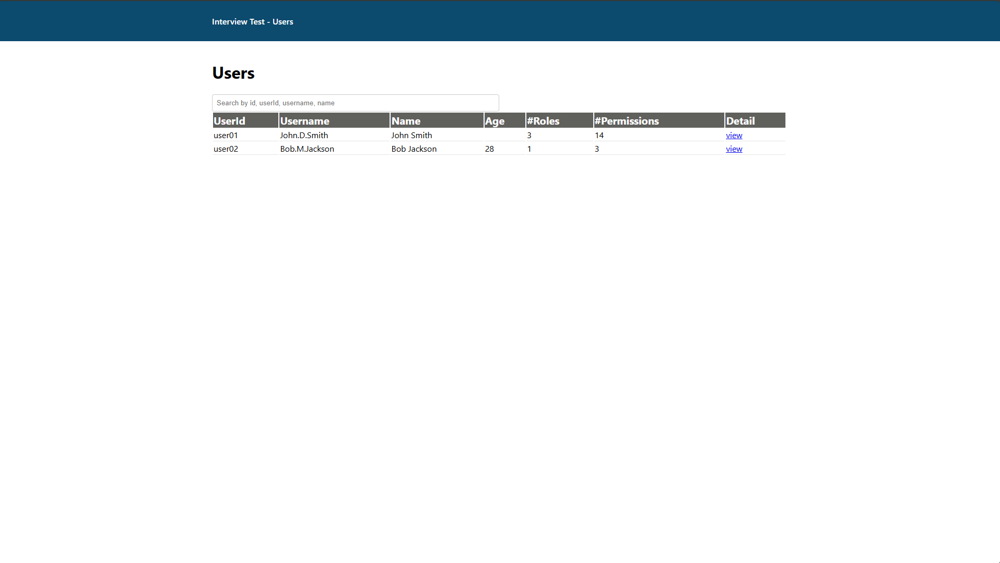
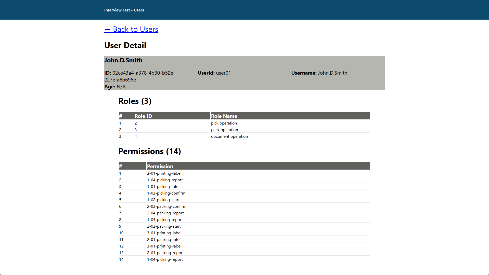

# Question
- Implement method `InvokeAsync` in [AuthenMiddleware.cs](#question) file to validate the `x-api-key` 
from request header. So your must be hashed the `x-api-key` by using SHA512 algorithm before you compare to the `hashedKey` in [AuthenMiddleware.cs](#question) file as below:
```csharp
private const string xApiKey = "<your hashed sha512 x-api-key>";

private const string hashedKey = "A6F9E3C2D7B81F4E0A9C5D6B2E1F8A7C4D0E9B6F5A3C8D2E1B7F9A4C6E0D5B8A1F2C9E7D6B4A3F5E0C8D2";
public Task InvokeAsync(HttpContext context, RequestDelegate next)
{
    var apiKeyHeader = context.Request.Headers["x-api-key"];
    if (string.IsNullOrEmpty(apiKeyHeader))
    {
        context.Response.StatusCode = 401;
        return context.Response.WriteAsync("API Key is missing");
    }

    string incomingHashedKey = HashSha512(apiKeyHeader!);
    string _hashedKey = HashSha512(hashedKey!);

    if (!string.Equals(
            incomingHashedKey,
            _hashedKey,
            StringComparison.OrdinalIgnoreCase))
    {
        context.Response.StatusCode = 401;
        return context.Response.WriteAsync("Invalid API key");
    }

    return next(context);
}

private string HashSha512(string value)
{
    using var sha512 = SHA512.Create();
    byte[] bytes = sha512.ComputeHash(Encoding.UTF8.GetBytes(value));
    return Convert.ToHexString(bytes); // 128-char hex string
}


```
and return `401 Unauthorized` if the `x-api-key` is invalid.

- Implement design database schema by using `Code-First and automated migration` approach in [InterviewTestDbContext.cs](#question) file to your database for the following requirement:
  - User can have multiple roles.
  - Role can have multiple permissions.

protected override void OnModelCreating(ModelBuilder modelBuilder)
{
    base.OnModelCreating(modelBuilder);
    modelBuilder.Entity<UserModel>(entity =>
    {
        entity.HasOne(urm => urm.UserProfile)
          .WithOne(u => u.User)
          .HasForeignKey<UserProfileModel>(p => p.ProfileId)
          .OnDelete(DeleteBehavior.Cascade);
    });

    modelBuilder.Entity<UserProfileModel>(entity =>
    {
        entity.HasOne(urm => urm.User)
          .WithOne(u => u.UserProfile)
          .HasPrincipalKey<UserModel>(u => u.Id)
          .OnDelete(DeleteBehavior.Cascade);
    });

    modelBuilder.Entity<UserRoleMappingModel>(entity =>
    {
        entity.HasOne(urm => urm.User)
          .WithMany(u => u.UserRoleMappings)
          .HasForeignKey("UserId")
          .HasPrincipalKey(u => u.Id)
          .OnDelete(DeleteBehavior.Cascade);
    });

    modelBuilder.Entity<UserRoleMappingModel>(entity =>
    {
        entity.HasOne(urm => urm.Role)
          .WithMany(u => u.UserRoleMappings)
          .HasForeignKey("RoleId")
          .HasPrincipalKey(u => u.RoleId)
          .OnDelete(DeleteBehavior.Cascade);
    });

    modelBuilder.Entity<PermissionModel>(entity =>
    {
        entity.HasOne(urm => urm.Role)
          .WithMany(u => u.Permissions)
          .HasForeignKey("RoleId")
          .HasPrincipalKey(u => u.RoleId)
          .OnDelete(DeleteBehavior.Cascade);
    });
}

**Important Note:** Please use `SQL Server` for your database schema design.

- Implement method `CreateUser` in [UserRepository.cs](#question) file and return affected row when execute `SaveChanges()` 
to create a new user by using `Entity Framework` and to create the user please use the data from `Data.cs` file.

public class UserRepository : IUserRepository
{
    private readonly InterviewTestDbContext _interviewTestDbContext;
    public UserRepository(InterviewTestDbContext interviewTestDbContext)
    {
        _interviewTestDbContext = interviewTestDbContext;
    }
    public async Task<dynamic> GetUserById(string id)
    {
        return await _interviewTestDbContext.UserTb
                .AsNoTracking()
                .Include(u => u.UserProfile)
                .Include(u => u.UserRoleMappings)
                    .ThenInclude(urm => urm.Role)
                    .ThenInclude(urm => urm.Permissions)
                .FirstOrDefaultAsync(dbUser => dbUser.Id.ToString() == id) ?? new UserModel();
    }

    public async Task<int> CreateUser(UserModel user)
    {
        if (await _interviewTestDbContext.UserTb.CountAsync(dbUser => dbUser.Id == user.Id) > 0)
        {
            return 100;
        }
        else
        {
            await _interviewTestDbContext.UserTb.AddAsync(user);
            return await _interviewTestDbContext.SaveChangesAsync();
        }
    }

    public async Task<dynamic> GetUsers()
    {
        return await _interviewTestDbContext.UserTb
                .AsNoTracking()
                .Include(u => u.UserProfile)
                .Include(u => u.UserRoleMappings)
                    .ThenInclude(urm => urm.Role)
                    .ThenInclude(urm => urm.Permissions)
                 .ToListAsync();
    }
}

- Implement method `GetUserById` in [UserRepository.cs](#question) file by using `Linq` to return the model similar to the `ExpectResult1.json` and `ExpectResult2.json`
as following:


  `ExpectResult1.json`
```json
{
  "id": "02CE43A4-A378-4B30-B52E-227EFA6B696E",
  "userId": "user01",
  "username": "John.D.Smith",
  "firstName": "John",
  "lastName": "Smith",
  "age": null,
  "roles": [
    {
      "roleId": 1,
      "roleName": "pick operation"
    },
    {
      "roleId": 2,
      "roleName": "pack operation"
    },
    {
      "roleId": 3,
      "roleName": "document operation"
    }
  ],
  "permissions": [
    "1-01-picking-info",
    "1-02-picking-start",
    "1-03-picking-confirm",
    "1-04-picking-report",
    "2-01-packing-info",
    "2-02-packing-start",
    "2-03-packing-confirm",
    "2-04-packing-report",
    "3-01-printing-label"
  ]
}
```

`ExpectResult2.json`
```json
{
  "id": "F90810B6-E017-431A-9DAE-A4BA7F9BC865",
  "userId": "user02",
  "username": "Bob.M.Jackson",
  "firstName": "Bob",
  "lastName": "Jackson",
  "age": 28,
  "roles": [
    {
      "roleId": 3,
      "roleName": "document operation"
    }
  ],
  "permissions": [
    "1-04-picking-report",
    "2-04-packing-report",
    "3-01-printing-label"
  ]
}
```

- Implement API by using `dependency injection` for interface `IUserRepositoy` file to return the model similar to the `ExpectResult1.json` and `ExpectResult2.json` as following:
  - `GET /api/user/GetUserById/{id}` in `UserController` file. as below:

```csharp
[HttpGet("GetUserById/{id}")]
public ActionResult GetUserById(string id)
{
    //Todo: Implement this method
    return Ok();
}

[HttpGet("GetUserById/{id}")]
public async Task<IActionResult> GetUserById(string id)
{
    return Ok(await _repository.GetUserById(id));
}
    
```

- Implement API by using `dependency injection` for interface `IUserRepositoy` file to create user from `Data.cs` file as following:
  - `Post /api/user/CreateUser` in `UserController` file. as below:

```csharp
[HttpPost("CreateUser")]
public ActionResult CreateUser(UserModel user)
{
    //Todo: Implement this method
    return Ok();
}

[HttpPost("CreateUser")]
public async Task<IActionResult> GetUserById([FromBody] UserModel user)
{
    // [FromBody] UserModel user
    //UserModel user = Interview_Test.Repositories.Data.Users[1];
    int result = await _repository.CreateUser(user);
    if (result == 100) return Ok("Duplicate user");
    return Ok("Add new user success");
}
```

- Implement gateway configuration in `configurationOcelot.json` file by using library `Ocelot` 
to  forward the client request to `Interview-Test.Api(https://localhost:44307)` with using the domain `https://localhost:44375/gateway`

# update program.cs for Cor, MiddleWare, JsonIgnore
```csharp
var builder = WebApplication.CreateBuilder(args);

// Add services to the container.
// Learn more about configuring Swagger/OpenAPI at https://aka.ms/aspnetcore/swashbuckle
builder.Services.AddEndpointsApiExplorer();
builder.Services.AddControllers();
builder.Services.AddSwaggerGen();
builder.Services.AddMvc(options => options.EnableEndpointRouting = false);
var connection = "Server=localhost;Database=InterviewTestDb;User=sa;Password=@Passw0rd;Encrypt=True;TrustServerCertificate=True;";
builder.Services.AddDbContext<InterviewTestDbContext>(options =>
    {
        options.UseSqlServer(connection,
            sqlOptions =>
            {
                sqlOptions.UseCompatibilityLevel(110);
                sqlOptions.CommandTimeout(30);
                sqlOptions.EnableRetryOnFailure(3, TimeSpan.FromSeconds(5), errorNumbersToAdd: null);
            });
    }
);

/** add service authen middleware */
builder.Services.AddScoped<AuthenMiddleware>();
builder.Services.AddScoped<IUserRepository, UserRepository>();
builder.Services.AddControllers()
    .AddJsonOptions(options =>
    {
        options.JsonSerializerOptions.ReferenceHandler =
            System.Text.Json.Serialization.ReferenceHandler.IgnoreCycles;
    });
builder.Services.AddCors(options =>
{
    options.AddPolicy("AllowAngular", policy =>
    {
        policy
            .WithOrigins("http://localhost:4200")
            .AllowAnyHeader()
            .AllowAnyMethod();
    });
});

var app = builder.Build();

// Configure the HTTP request pipeline.
if (app.Environment.IsDevelopment())
{
    app.UseSwagger();
    app.UseSwaggerUI();
}


/** database migrations before build */
var scope = app.Services.CreateAsyncScope();
InterviewTestDbContext db = scope.ServiceProvider.GetRequiredService<InterviewTestDbContext>();
await db.Database.MigrateAsync();


app.UseCors("AllowAngular");
app.UseMiddleware<AuthenMiddleware>();
app.UseMvc();
app.Run();
```

# Interview-Test.Client (Frontend Angular)

- Implement screen Users List





```typescript
export class UsersListComponent {
  users: User[] = [];
  sortUsers: User[] = [];

  constructor(private http: HttpClient) {}
  ngOnInit(): void {
    this.loadUsers();
  }


  loadUsers(): void {
    this.http.get<User[]>("https://localhost:5000/api/User/GetUsers", {
      headers: {
        "x-api-key": "A6F9E3C2D7B81F4E0A9C5D6B2E1F8A7C4D0E9B6F5A3C8D2E1B7F9A4C6E0D5B8A1F2C9E7D6B4A3F5E0C8D2"
      }
    }).subscribe(data => {
      console.log(data);
      this.users = data;
      this.sortUsers = this.users;
    });
  }
  getPermissionCount(roles: MapRole[]): number {
    return roles.map(role => role.role.permissions.length).reduce((total, n) => total + n, 0);
  }
  searchUser(event: Event): void {
    const value = (event.target as HTMLInputElement).value.trim();
    this.sortUsers = value === ''
    ? this.users
    : this.users.filter(user => 
      user.id.includes(value)
      || user.userId.includes(value)
      || user.username.includes(value)
      || user.userProfile.firstName.includes(value)
      || user.userProfile.lastName.includes(value)
    )
  }
}

interface Permission {
  permission: string;
  permissionId: number;
}
interface Role {
  userRoleMappingId: string;
  permissions: Permission[];
  roleId: number;
  roleName: string;
}
interface MapRole {
  userRoleMappingId: string;
  role: Role;
}
interface UserProfile {
  firstName: string;
  lastName: string;
  age: number;
  profileId: string;
}
interface User {
  id: string;
  username: string;
  userId: string;
  userProfile: UserProfile;
  userRoleMappings: MapRole[];
}
```
``` html
<h1>Users</h1>
<input type="search" name="searchUser" id="searchUser" placeholder="Search by id, userId, username, name" style="width: 50%;" (input)="searchUser($event)">
<table style="width: 100%;">
    <thead style="text-align: left; background-color: rgb(96, 96, 93); color: white; font-size: 20px;">
        <tr style="text-align: left;">
            <th>UserId</th>
            <th>Username</th>
            <th>Name</th>
            <th>Age</th>
            <th>#Roles</th>
            <th>#Permissions</th>
            <th>Detail</th>
        </tr>
    </thead>
    <tbody>
        <tr *ngFor="let user of sortUsers">
            <td style="border-bottom: 1px solid rgb(231, 228, 228);">{{ user.userId }}</td>
            <td style="border-bottom: 1px solid rgb(231, 228, 228);">{{ user.username }}</td>
            <td style="border-bottom: 1px solid rgb(231, 228, 228);">{{ user.userProfile.firstName }} {{ user.userProfile.lastName }}</td>
            <td style="border-bottom: 1px solid rgb(231, 228, 228);">{{ user.userProfile.age }}</td>
            <td style="border-bottom: 1px solid rgb(231, 228, 228);">{{ user.userRoleMappings.length }}</td>
            <td style="border-bottom: 1px solid rgb(231, 228, 228);">{{ getPermissionCount(user.userRoleMappings) }}</td>
            <td style="border-bottom: 1px solid rgb(231, 228, 228);">
                <a href="/users/{{user.id}}">view</a>
            </td>
        </tr>
    </tbody>
</table>
```
- Implement screen Users Detail 



``` typescript
@Component({
    standalone: true,
    selector: 'app-user-detail',
    imports: [CommonModule],
    templateUrl: './user-detail.component.html',
})
export class UserDetailComponent {
    id!: string;
    user!: User;
    permissions: Permission[] = [];
    constructor(private route: ActivatedRoute, private http: HttpClient) {}

    ngOnInit(): void {
        this.id = this.route.snapshot.paramMap.get('id')!;
        this.http.get<User>(`https://localhost:5000/api/User/GetUserById/${this.id}`,{
            headers: {
                "x-api-key": "A6F9E3C2D7B81F4E0A9C5D6B2E1F8A7C4D0E9B6F5A3C8D2E1B7F9A4C6E0D5B8A1F2C9E7D6B4A3F5E0C8D2"
            }
        })
        .subscribe(data => {
            this.user = data;
            data.userRoleMappings.forEach(role => {
                role.role.permissions.forEach(permission => {
                    this.permissions.push(permission);
                    console.log(permission);
                });
            });
            console.log(this.permissions);
        });
    }
    getPermissionCount(roles: MapRole[]): number {
        return roles.map(role => role.role.permissions.length).reduce((total, n) => total + n, 0);
    }
}


interface Permission {
  permission: string;
  permissionId: number;
}
interface Role {
  userRoleMappingId: string;
  permissions: Permission[];
  roleId: number;
  roleName: string;
}
interface MapRole {
  userRoleMappingId: string;
  role: Role;
}
interface UserProfile {
  firstName: string;
  lastName: string;
  age: number;
  profileId: string;
}
interface User {
  id: string;
  username: string;
  userId: string;
  userProfile: UserProfile;
  userRoleMappings: MapRole[];
}
```
``` html
<a href="/users" style="font-size: 30px;">&larr; Back to Users</a>
<h1>User Detail</h1>
<section style="background-color: rgb(182, 182, 176);">
    <h2>{{user?.username}}</h2>
    <div style="display: grid; grid-template-columns: 1fr 1fr 1fr;">
        <div style="font-size: 20px;"><b>ID:</b> {{user?.id}}</div>
        <div style="font-size: 20px;"><b>UserId:</b> {{user?.userId}}</div>
        <div style="font-size: 20px;"><b>Username:</b> {{user?.username}}</div>
    </div>
    <div style="font-size: 20px;"><b>Age: </b>{{user?.userProfile?.age === null ? 'N/A' : user?.userProfile?.age}}</div>
</section>
<h1 style="width: 90%; margin-left: auto; margin-right: auto;">Roles ({{user?.userRoleMappings?.length}})</h1>
<table style="width: 90%; margin-left: auto; margin-right: auto;">
    <thead style="text-align: left; background-color: rgb(96, 96, 93); color: white; font-size: 20px;">
        <tr>
            <th>#</th>
            <th>Role ID</th>
            <th>Role Name</th>
        </tr>
    </thead>
    <tbody>
        <tr *ngFor="let user of user?.userRoleMappings; let iRole = index" style="border-bottom: 1px;">
            <td style="border-bottom: 1px solid rgb(231, 228, 228);">{{iRole + 1}}</td>
            <td style="border-bottom: 1px solid rgb(231, 228, 228);">{{user?.role?.roleId}}</td>
            <td style="border-bottom: 1px solid rgb(231, 228, 228);">{{user?.role?.roleName}}</td>
        </tr>
    </tbody>
</table>
<h1 style="width: 90%; margin-left: auto; margin-right: auto;">Permissions ({{permissions?.length}})</h1>
<table style="width: 90%; margin-left: auto; margin-right: auto;">
    <thead style="text-align: left; background-color: rgb(96, 96, 93); color: white; font-size: 20px;">
        <tr>
            <th>#</th>
            <th>Permission</th>
        </tr>
    </thead>
    <tbody>
        <tr *ngFor="let permission of permissions; let iPermission = index">
            <td style="border-bottom: 1px solid rgb(231, 228, 228);">{{iPermission + 1}}</td>
            <td style="border-bottom: 1px solid rgb(231, 228, 228);">{{permission?.permission}}</td>
        </tr>
    </tbody>
</table>
```
- Connect data from API Gateway Ocelot.